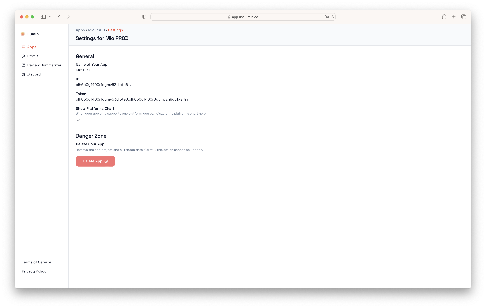

# Finding your Token

Your app's Lumin token will be displayed during setup. When you wan to view it at a later time, you dan do so in your Lumin app's settings:

To view your app's settings, head over to your app's dashboard and then click on "Settings" in the upper right corner.