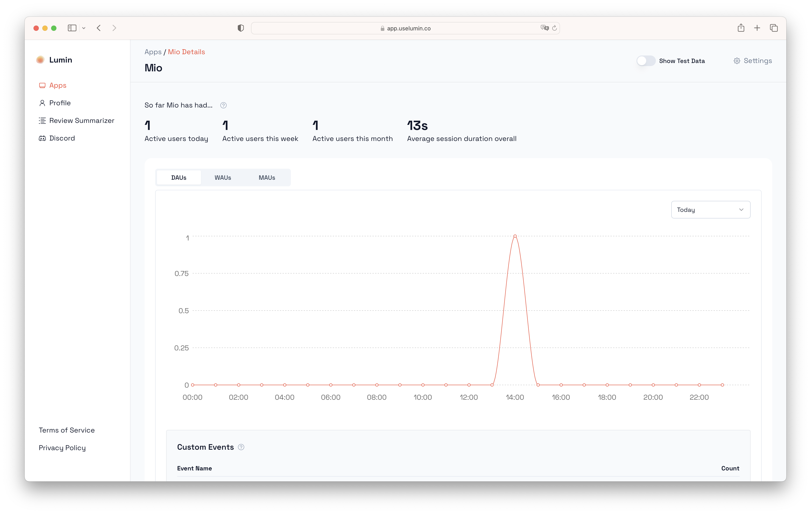
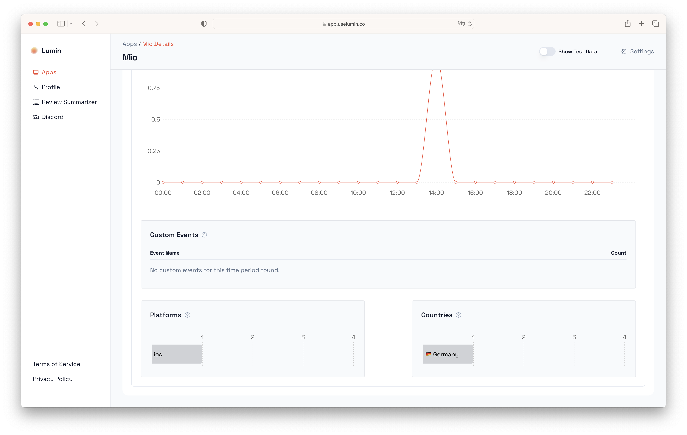
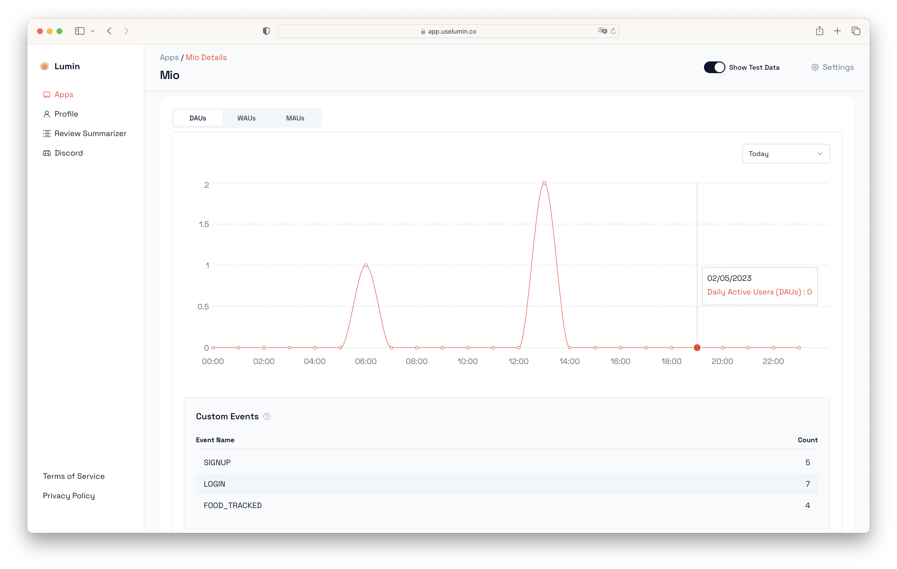

# Explore your Dashboard 

If you have only done the onboarding, your first view of your dashboard will look similar to this:

:::info

You will have to close your app first to see the average session duration.

:::

If you scroll down, you should see the platform and country stats as well as custom events (which will be empty right now):

As your continue using your app, this dashboard will fill with more events.

## View Test Data

To get a feeling for what your app's dashboard will look like in the future, you can temporarily view test data we have set up for you. To do this, click on the "Show Test Data" toggle in the upper right corner.

Here you can see how Custom Events that you send via the `.trackCustomEvent()` method will be tracked as well.