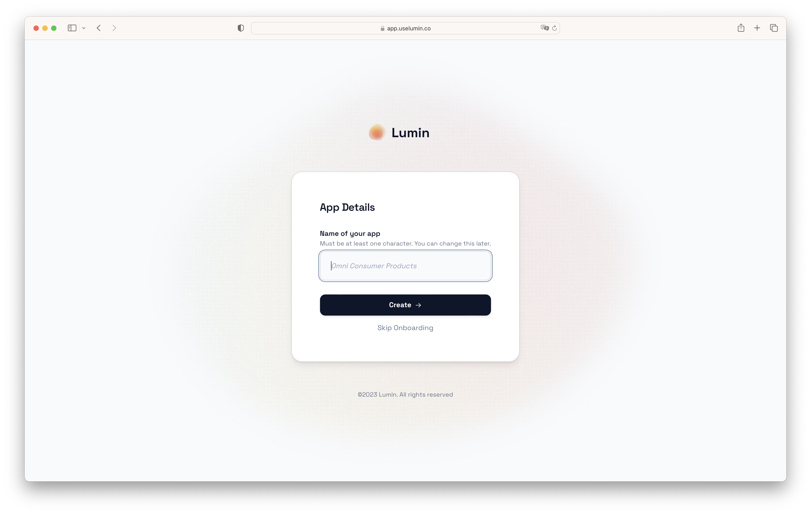
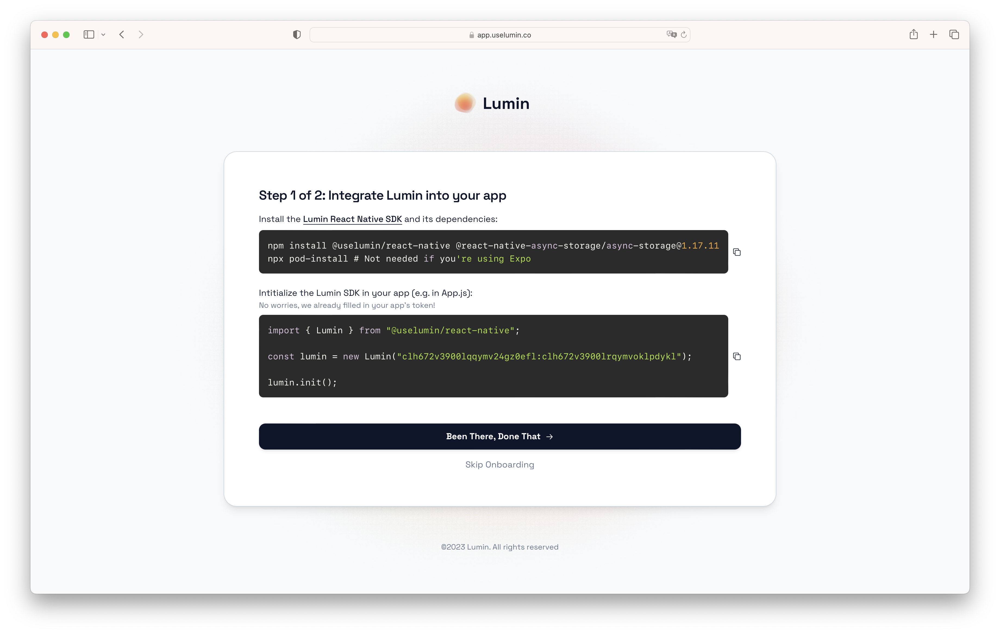
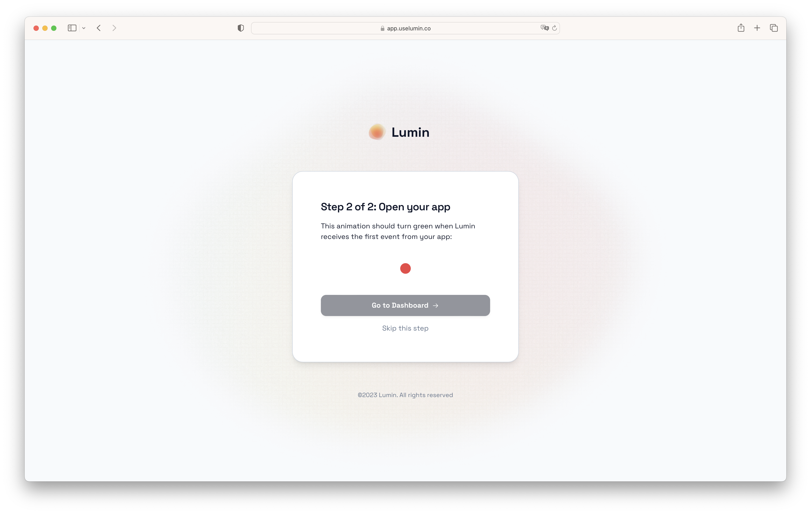

import Tabs from '@theme/Tabs';
import TabItem from '@theme/TabItem';

# App Setup

After [signing up](./register-account.md), Lumin will guide you through setting up your first app. This onboarding only takes 3 steps–or 2 minutes–and ensures that you're set up for success.

If you don't want to do this right now, you can skip it by clicking "Skip Onboarding".

## Choose a Name

The first thing you'll have to do is choose a name for your app. This name doesn't _have_ to be the real name of your app–it can be (almost) anything–but it makes sense to choose a name that helps you and your teammates identify the app.

:::tip

If you have multiple environments like `dev`, `staging` and `production`, we recommend creating different apps for each environment. In that case, you will most likely want to name your app something like "<Your App's Name> DEV". You can later create apps for your other environments at no additional cost.

:::



When you entered a name, click the button labeld "Create".

## Intergrate Lumin Into Your App

Next, you need to add the Lumin SDK to your app. Depending on the language or framework you use to build your app, this step will be slightly different.



:::info

Right now, we only support React Native. But we'll relase our Flutter SDK in the coming weeks.

:::

<Tabs>
<TabItem value="react-native" label="React Native" default>

Install the Lumin React Native SDK and its dependencies:

<Tabs>
<TabItem value="npm" label="npm" default>

```bash
  npm install @uselumin/react-native @react-native-async-storage/async-storage@1.17.11
  npx pod-install # Not needed if you're using Expo
```

</TabItem>
<TabItem value="yarn" label="yarn" default>

```bash
  yarn add @uselumin/react-native @react-native-async-storage/async-storage@1.17.11
  npx pod-install # Not needed if you're using Expo
```

</TabItem>

</Tabs>

Intitialize the Lumin SDK in your app (e.g. in App.js):

```jsx title="App.js"
import { Lumin } from "@uselumin/react-native";

const lumin = new Lumin("<Your Token>");

lumin.init();
```

The above code snippet will already be populated with the correct token during your onboarding.

Once you're finished, click the button labeled "Been There, Done That".

</TabItem>
  <TabItem value="flutter" label="Flutter">
    Coming soon!
  </TabItem>
  <TabItem value="swift" label="Swift">
    Coming soon!
  </TabItem>
  <TabItem value="kotlin" label="Kotlin">
    Coming soon!
  </TabItem>
</Tabs>

## Open Your App

Finally, open your app. (Opening it in the simulator works for this!)



The red dot should turn green once the Lumin SDK has automatically sent its first event. Aftewards, you can click the button labeled "Go to Dashboard" to view your app's statistics.