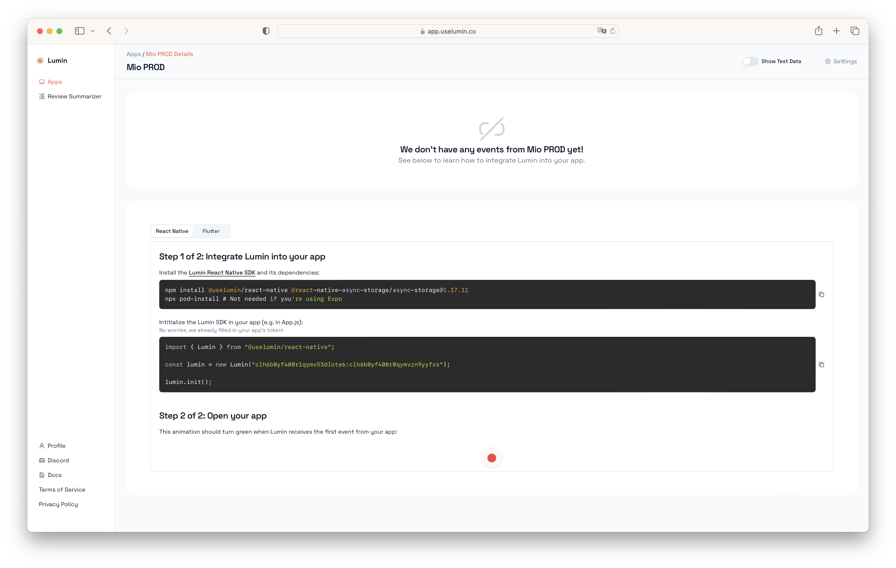

import Tabs from '@theme/Tabs';
import TabItem from '@theme/TabItem';

# App Setup

After [signing up](./create-account), Lumin will guide you through setting up your first app. This onboarding only takes 3 steps–or 2 minutes–and ensures that you're set up for success.

If you don't want to do this right now, you can skip it by clicking "Skip Onboarding".

## Choose a Name

The first thing you'll have to do is choose a name for your app. This name doesn't _have_ to be the real name of your app–it can be (almost) anything–but it makes sense to choose a name that helps you and your teammates identify the app.

:::tip

If you have multiple environments like `dev`, `staging` and `production`, we recommend creating different apps for each environment. In that case, you will most likely want to name your app something like "<Your App's Name> DEV". You can later create apps for your other environments at no additional cost.

:::


When you entered a name, click the button labeld "Create".

## Intergrate Lumin Into Your App

Next, you need to add the Lumin SDK to your app. Depending on the language or framework you use to build your app, this step will be slightly different.



<Tabs>
<TabItem value="react-native" label="React Native" default>

Install the Lumin React Native SDK and its dependencies:

<Tabs>
<TabItem value="npm" label="npm" default>

```bash
  npm install @uselumin/react-native @react-native-async-storage/async-storage@1.17.11
  npx pod-install # Not needed if you're using Expo
```

</TabItem>
<TabItem value="yarn" label="yarn" default>

```bash
  yarn add @uselumin/react-native @react-native-async-storage/async-storage@1.17.11
  npx pod-install # Not needed if you're using Expo
```

</TabItem>

</Tabs>

Intitialize the Lumin SDK in your app (e.g. in App.js):

```jsx title="App.js"
import { Lumin } from "@uselumin/react-native";

const lumin = new Lumin("<Your Token>");

lumin.init();
```

The above code snippet will already be populated with the correct token.

</TabItem>
  <TabItem value="flutter" label="Flutter">
    Install the Lumin Flutter SDK and its dependencies:

```bash
dart pub add lumin_flutter
```

Then, intialize Lumin in your `main` function:

```dart
import 'package:lumin_flutter/lumin_flutter.dart';

void main() async {
  WidgetsFlutterBinding.ensureInitialized();

  await Lumin.init("<Your Lumin App Token>");

  runApp(const MyApp());
}
```

The above code snippet will already be populated with the correct token.

Finally, wrap your app in the `LuminLifecycleLogger` widget:

```dart
class MyApp extends StatelessWidget {
  const MyApp({super.key});

  // This widget is the root of your application.
  @override
  Widget build(BuildContext context) {
    return LuminLifecycleLogger(
      child: MaterialApp(
        // ...
      )
    );
  }
}
```

  </TabItem>
  <TabItem value="swift" label="Swift">
    Coming soon!
  </TabItem>
  <TabItem value="kotlin" label="Kotlin">
    Coming soon!
  </TabItem>
</Tabs>

Once you open your app for the first time (or send a [Custom Event](./custom-events)), your dashboard should show your statistics.

:::caution

Each app will have a different token, so make sure you use the correct one.

:::