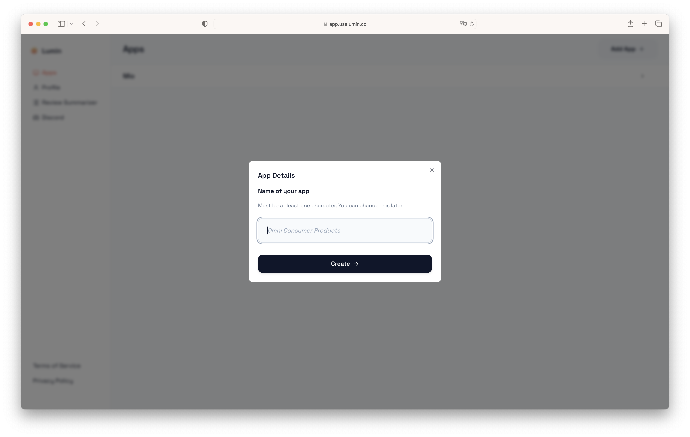

import Tabs from '@theme/Tabs';
import TabItem from '@theme/TabItem';

# Having Multiple Apps

You can track as many apps from one Lumin account as you want. Your price tier will be determined based on the combined MAUs of all your apps.

## Create Additional Apps

Click on "Apps" in the sidebar to view the list of all your apps. 


To create additional apps, click on the button labeled "Add App +" in the upper right corner.



Afterwards, you will be shown instructions for how to integrate Lumin into your app.


:::info

Right now, we only support React Native. But we'll relase our Flutter SDK in the coming weeks.

:::

<Tabs>
<TabItem value="react-native" label="React Native" default>

Install the Lumin React Native SDK and its dependencies:

<Tabs>
<TabItem value="npm" label="npm" default>

```bash
  npm install @uselumin/react-native @react-native-async-storage/async-storage@1.17.11
  npx pod-install # Not needed if you're using Expo
```

</TabItem>
<TabItem value="yarn" label="yarn" default>

```bash
  yarn add @uselumin/react-native @react-native-async-storage/async-storage@1.17.11
  npx pod-install # Not needed if you're using Expo
```

</TabItem>

</Tabs>

Intitialize the Lumin SDK in your app (e.g. in App.js):

```jsx title="App.js"
import { Lumin } from "@uselumin/react-native";

const lumin = new Lumin("<Your Token>");

lumin.init();
```

The above code snippet will already be populated with the correct token.

</TabItem>
  <TabItem value="flutter" label="Flutter">
    Coming soon!
  </TabItem>
  <TabItem value="swift" label="Swift">
    Coming soon!
  </TabItem>
  <TabItem value="kotlin" label="Kotlin">
    Coming soon!
  </TabItem>
</Tabs>

These are the same instructions as in [the onboarding](./getting-started/set-up-app).

Once you open your app for the first time (or send a [Custom Event](./custom-events)), your dashboard should show your statistics.

:::caution

Each app will have a different token, so make sure you use the correct one.

:::
